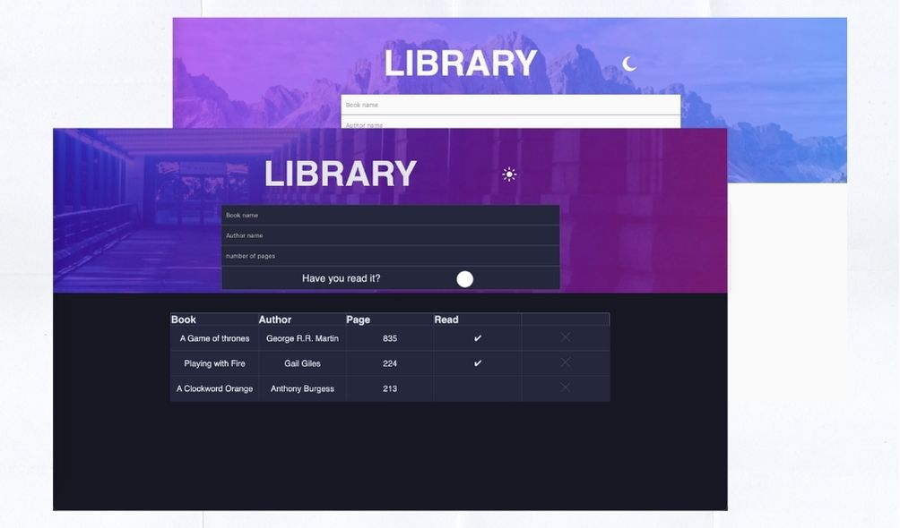
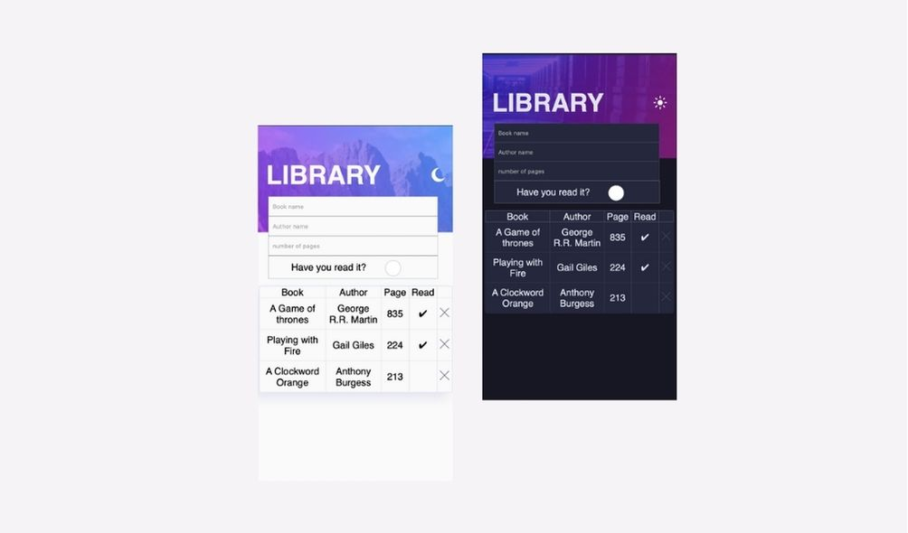

# Library App

A modified version of a todo app but with books instead. The user can list a book's name, the author, the page amount, and whether or not they read the book.

### App Design

### Links

[Demo the App]()

## My process

### Built with

- HTML
- Sass
- Javascript
- Mobile-first workflow

### What I learned

This project was crucial for me to better approach my workflow. I had to be more organized to avoid spending too much time refactoring code. I used this project to learn the fundamentals of object-oriented programming and what goes on under the hood of javascript objects and prototyping.

### Continued development

Somethings that are not included in the app is a filtering feature. In the future, I would take a better approach at adding a feature where the user can specify what data they want to be shown based on what information they have inputted.

## Author

-Website - [Joshua Mendoza](https://jfusedesigns.com)

-Twitter - [@jfusecodes](https://twitter.com/jfusecodes)

## Acknowledgments

I certainly must give a hat tip to StackOverflow member [emkey08](https://stackoverflow.com/users/1070129/emkey08) who provided some code for allowing only numbers in the page amount input. It proved to be very useful.
