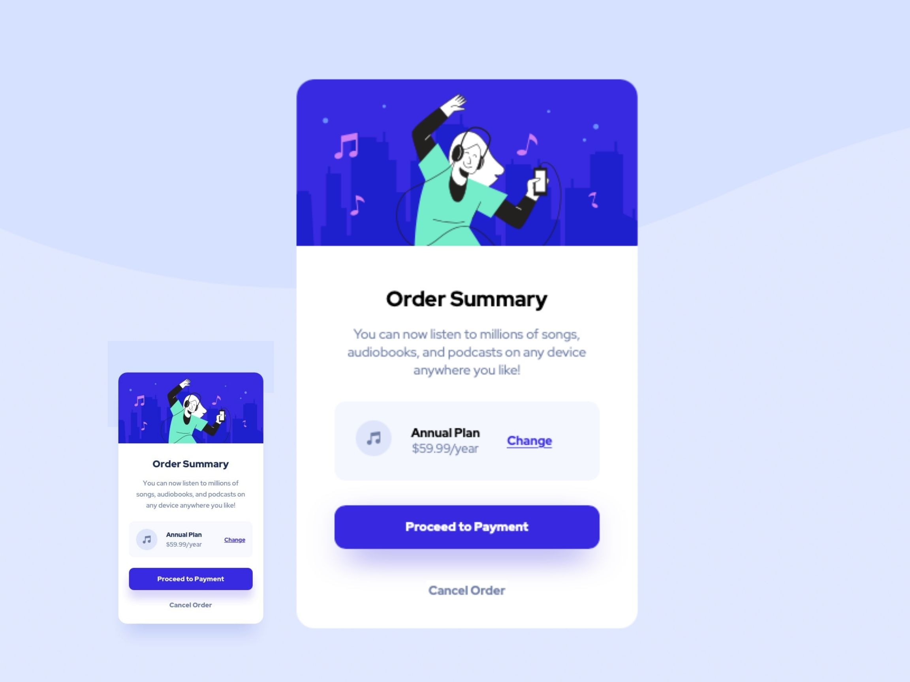

# Order Summary Card

#OVERVIEW
This is a simple project that displays what a user would view if they plan to purchase a product
or a service.Usually it is the precursor to a form requiring payment information.

#TECHNOLOGIES USED:
HTML:
 -Semantic HTML Markup
CSS:
 -Custom properties
 -Flexbox
 -Mobile-first workflow

#IMAGES:

#CHALLENGES:
My biggest challenge was getting a better grasp of media queries and trying to get the perfect touch as far as different screen sizes go. It helped me improve on that end.

#USEFUL RESOURCES:
These are the websites i used that proved to be very helpful in the development of this card:
  -https://developer.mozilla.org/en-US/docs/Web/CSS/Media_Queries/Using_media_queries - very informative

  -https://www.google.com/search?client=safari&rls=en&q=w3+media+queries&ie=UTF-8&oe=UTF-8 - a visual explanation of media queries with a hands on experience

#AUTHOR:
 -Twitter - [@JfuseCodes](https://www.twitter.com/JfuseCodes)
